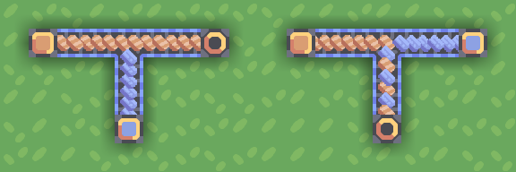
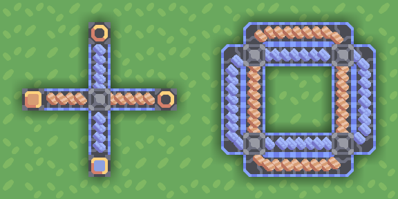
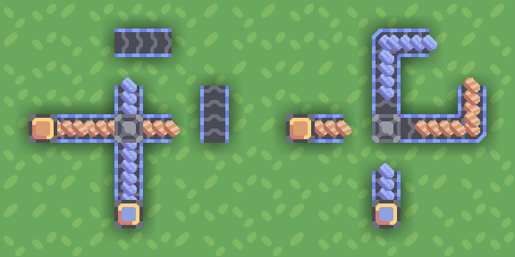
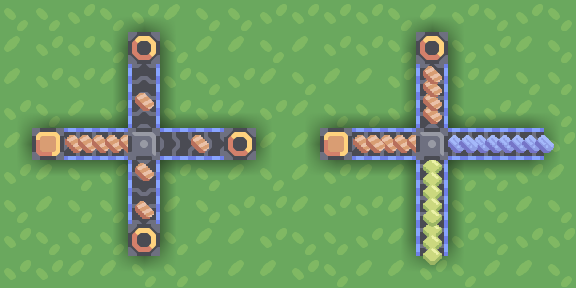
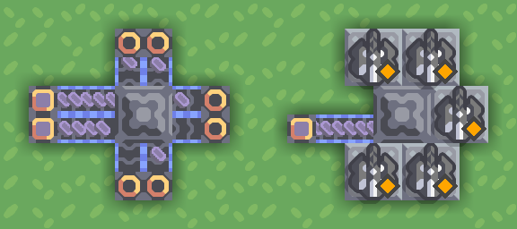
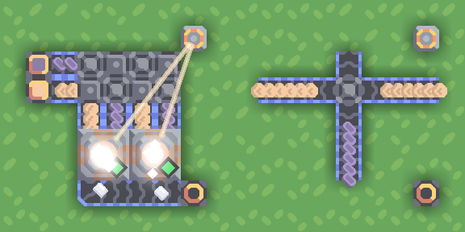

## Conveyors

Conveyor belts transport items.

There are several kinds of conveyor belts in the game, varying in their speed/health/properties.

Most conveyor belts can be joined together to combine lines of items:

  
- When joining a conveyor belt to another, items traveling straight take priority when the conveyor is full.  
- If two conveyor belts meet face to face (with output going in a third direction), items are mixed at ~1:1 rate even if the conveyors are full.
- It is best to not rely on conveyor belts being over capacity, but you can control resource priority this way.

## Junctions

Junctions allow conveyors belts to cross without joining.

Most uses are obvious - you can cross paths or cut a few blocks on a corner turn while inverting conveyor order.

Although you cannot see their contents, junctions themselves store a few items - 6 per movement direction as of Mindustry v7.

You can observe this by disconnecting junction's outputs, disconnecting inputs, and then connecting outputs again:

  
*Leftover items flowing out of a junction*

## Routers

Routers are the best and also the worst - "a necessary evil" as the game puts it.

A router accepts items from any side and outputs them to whichever side that can accept it ("routing"):

A router can put items directly into buildings, but be careful - buildings with item outputs can also put items back in the router, clogging the line (as an item cannot re-enter the building and cannot leave).

A distributor is a bigger version of a router, capable of splitting items between more outputs. It can be particularly convenient for supplying ammo to turrets:

A less obvious thing about routers is that a router can even output items _backwards_ into a junction, meaning that junctions inside a common checkerboard-pattern factory supply chain tend to store items in 3 or even 4 directions:

While routers and distributors are perfect for splitting items evenly between conveyors or destinations that need them, for many cases it is preferable to have deterministic logic, which gets us to: