## Sorters and flow gates

### Overflow/underflow gates

An overflow moves items forward when possible and to the side(s) otherwise:

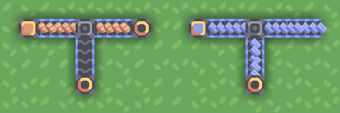

An underflow is the opposite:

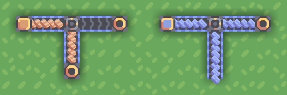

The two allow for resource distribution logic - for example, you might want to feed your graphite to the turrets first-most and send the rest to the core.

### Sorters

Sorters can be placed and configured by pressing on them afterwards.
A sorter passes the chosen item forward while passing the rest to the side(s).  
An inverted sorter is the opposite - it passes the chosen item to the side(s) while passing the rest forward:

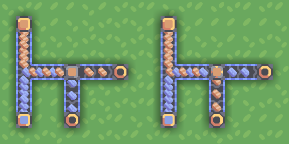

A sorter with no item type selected (click on item type again to deselect), also called a "null sorter", will always output items to the side while an inverted sorter will always output items forward:

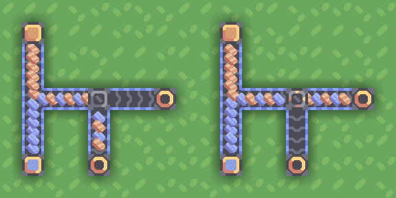

This enables the inverted sorter to be used as a faux junction and a normal sorter to "bounce" two conveyor belts off each other without using any space:

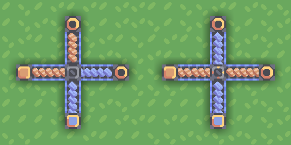

Since sorters and gates accept items from any direction, This enables them to be used in variously creative ways, such as to swap contents of two item lines:

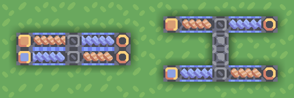

If a sorter cannot move items in the intended direction, it will not let them through, causing the line to become "clogged".  
You can get around this by introducing an overflow gate behind the sorter that sends any extra resources back on the main line:

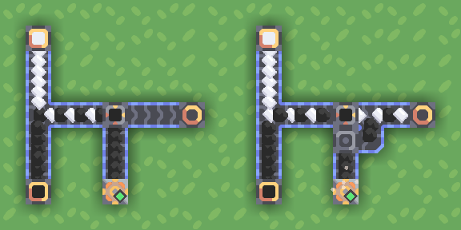

### Notes and caveats

First thing to note is that - in contrast to most other blocks - sorters and gates have no inventory and process items instantly: as soon as an item enters one of these from one side, it exits from another:

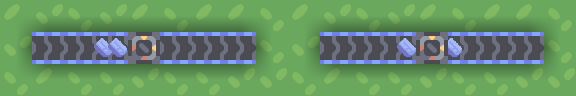

However (perhaps to discourage using sorters instead of actual conveyors), an item may only pass through two blocks of the group (e.g. two sorters, or a sorter and an overflow, etc.) at a time, and then you'll need a "normal" block between sets of 2:

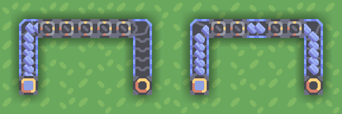

All 4 blocks will try to split resources equally between side inputs, which allows them to be used in place of a router in 2-output situations:

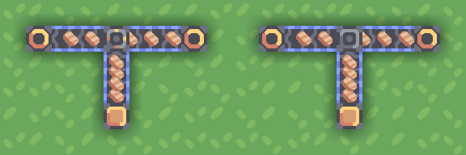

For reasons best described as ["videogames are hard to make"](https://github.com/Anuken/Mindustry/issues/1449), you may occasionally see a single item escape through the overflow/underflow gate despite the intended destination not having a full conveyor belt. This isn't usually a big concern, but can be fixed by adding a junction after the gate:

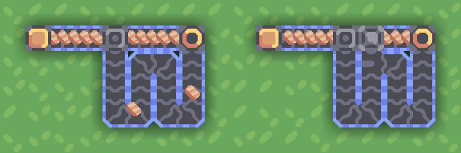
