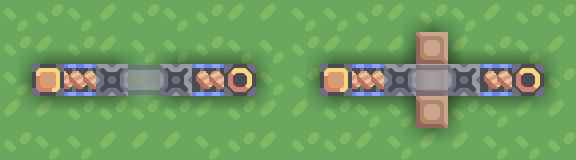
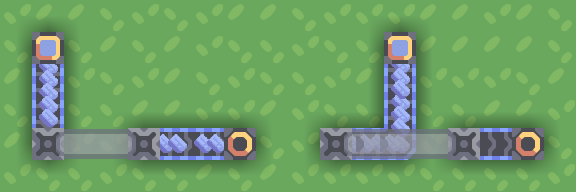
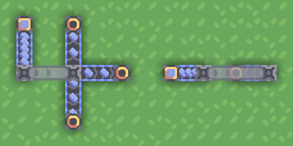
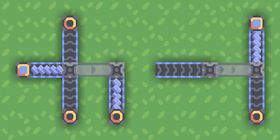
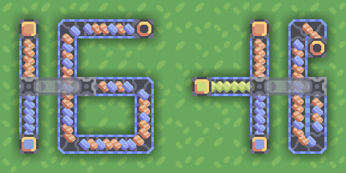
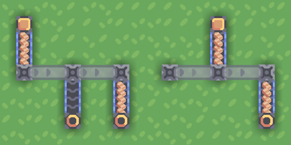
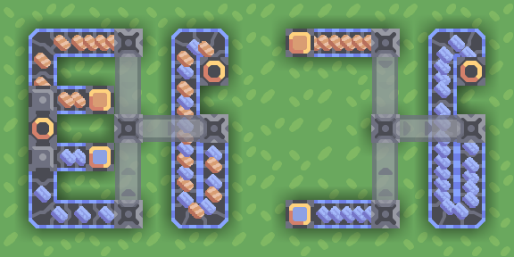
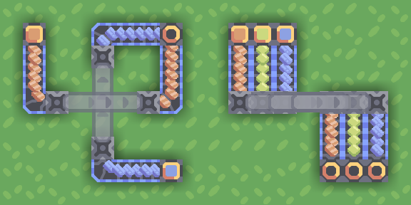
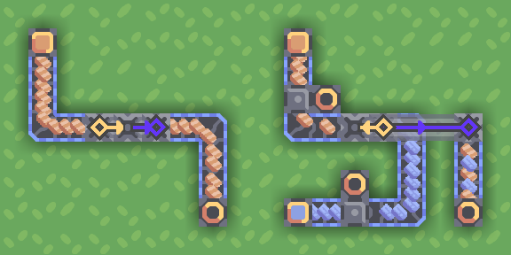

## Bridge conveyors

Bridges allow transporting items across various obstacles - terrain, conveyors, conduits, buildings, or anything else.

They also play a key role when creating compact schematics.

The "beginning" block of a bridge can accept inputs from the back or from the sides, but not from the direction where it's going:

The "end" block of a bridge will output items wherever it can, except in the direction where it came from:

You cannot output items from the beginning of a bridge and cannot input items to the end of a bridge:

You can input blocks from multiple directions into the beginning of a bridge, though as of the current game version this tends to work slightly strangely when the bridge is over capacity:

You can chain bridges - the "midpoints" will act as beginning-points, accepting additional items and not outputting anything:

You can also join multiple bridges together, although results are less predictable if the bridge is over capacity:

Bridges can intersect other bridges, including in less-obvious ways:

  
(second example has each of 3 bridges go for 3 tiles to the right)

Bridges can be zero-length, which can be used to bypass "no input from movement direction" / "no input to the bridge end" rules:

  