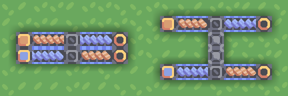

# Notes on Mindustry

An opening note: this guide focuses on game mechanics rather than ever-changing numbers.

## Conveyors

Conveyor belts transport items.

There are several kinds of conveyor belts in the game, varying in their speed/health/properties.

Most conveyor belts can be joined together to combine lines of items:

  
- When joining a conveyor belt to another, items travelling straight take priority when the conveyor is full.  
- If two conveyor belts meet face to face (with output going in third direction), items are mixed at ~1:1 rate even if the conveyors are full.
- It is best to not rely on conveyor belts being over capacity, but you can control resource priority this way.

## Junctions

Junctions allow conveyors belts to cross without joining.

Most uses are obvious - you can cross paths or cut a few blocks on a corner turn while inverting conveyor order.

Although you cannot see their contents, junctions themselves store a few items - 6 per movement direction as of Mindustry v7.

You can observe this by disconnecting junction's outputs, disconnecting inputs, and then connecting outputs again:

  
Leftover items flowing out of a junction

## Routers

Routers are the best and also the worst - "a necessary evil" as the game puts it.

A router accepts items from any side and outputs them to whichever side that can accept it ("routing"):

A router can put items directly into buildings, but be careful - buildings with item outputs can also put items back in the router, clogging the line (as an item cannot re-enter the building and cannot leave).

A distributor is a bigger version of a router, capable of splitting items between more outputs. It can be particularly convenient for supplying ammo to turrets:

A less obvious thing about routers is that a router can even output items _backwards_ into a junction, meaning that junctions inside a common checkerboard-pattern factory supply chain tend to store items in 3 or even 4 directions:

While routers and distributors are perfect for splitting items evenly between conveyors or destinations that need them, for many cases it is preferable to have deterministic logic, which gets us to:

## Sorters and overflows

### Overflow/underflow gates

An overflow moves items forward when possible and to the side(s) otherwise:

An underflow is the opposite:

The two allow for resource distribution logic - for example, you may want to feed your graphite to the turrets first-most and send the rest to the core.

For reasons best described as "videogames are hard to make", you may occasionally see a single item escape through the overflow/underflow gate despite the intended destination not having a full conveyor belt.

### Sorters

Sorters can be placed and configured by pressing on them afterwards.
A sorter passes the chosen item foreward while passing the rest to the side(s).  
An inverted sorter is the opposite - it passes the chosen item to the side(s) while passing the rest forward:

A sorter with no item type selected (click on item type again to deselect), also called a "null sorter", will always output items to the side while an inverted sorter will always output items forward:

This enables the inverted sorter to be used as a faux junction and a normal sorter to "bounce" two conveyor belts off each other without using any space:

Since sorters and gates accept items from any direction, This enables them to be used in variously creative ways, such as to swap contents of two item lines:

If a sorter cannot move items in the intended direction, it will not let them through, causing the line to become "clogged".  
You can get around this by introducing an overflow gate behind the sorter that sends any extra resources back on the main line:

### Notes and caveats

First thing to note is that - in contrast to most other blocks - sorters and gates have no inventory and process items instantly: as soon as an item enters one of these from one side, it exits from another:

However (perhaps to discourage using sorters instead of actual conveyors), an item may only pass through two blocks of the group (e.g. two sorters, or a sorter and an overflow, etc.) at a time, and then you'll need a "normal" block between sets of 2:

All 4 blocks will try to split resources equally between side inputs, which allows them to be used in place of a router in 2-output situations:

An overflow/underflow gate may [occasionally](https://github.com/Anuken/Mindustry/issues/1449) output an item or two to the other line despite there being enough space on the intended one. This isn't usually a big concern, but can be fixed by adding a junction after the gate:

## Bridge conveyors

Bridges allow transporting items across various obstacles - terrain, conveyors, conduits, buildings, or anything else.

They also play a key role when creating compact schematics.

The "beginning" block of a bridge can accept inputs from the back or from the sides, but not from the direction where it's going:

The "end" block of a bridge will output items wherever it can, except in the direction where it came from:

You cannot output items from the beginning of a bridge and cannot input items to the end of a bridge:

You can input blocks from multiple directions into the beginning of a bridge, though as of the current game version this tends to work slightly strangely when the bridge is over capacity:

You can chain bridges - the "midpoints" will act as beginning-points, accepting additional items and not outputting anything:

You can also join multiple bridges together, although results are less predictable if the bridge is over capacity:

Bridges can intersect other bridges, including in less-obvious ways:

  
(second example has each of 3 bridges go for 3 tiles to the right)

Bridges can be zero-length, which can be used to bypass "no input from movement direction" / "no input to the bridge end" rules:

  

## Production

TODO:

- Output is evenly split between surrounding blocks that can accept it
- Buildings can output directly into other buildings

## Unloader

TODO:

- v6/v7 differences
- Equalizing resources between buildings

## Overdrive projector

TODO:

- Boosting power sources is free\* electricity.
- Conveyor belt behaviour

## Mass Driver

TODO:

- Can unload directly to buildings or core
- Slowdown in case of rotation
- Limits

<!-- Vars.renderer.maxZoom=4 -->